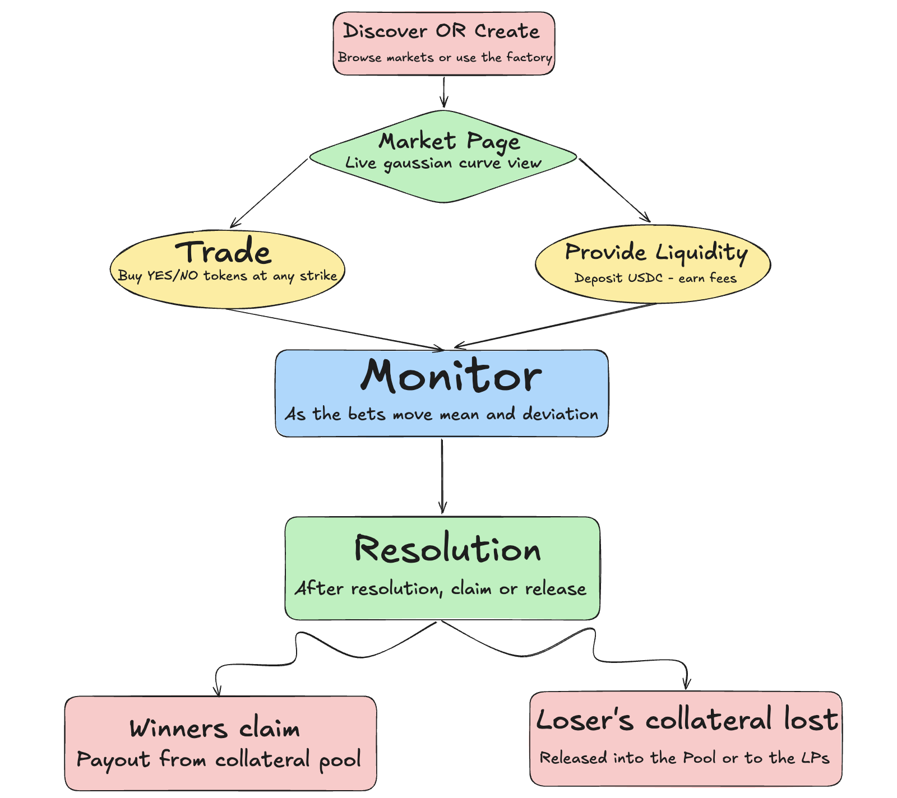
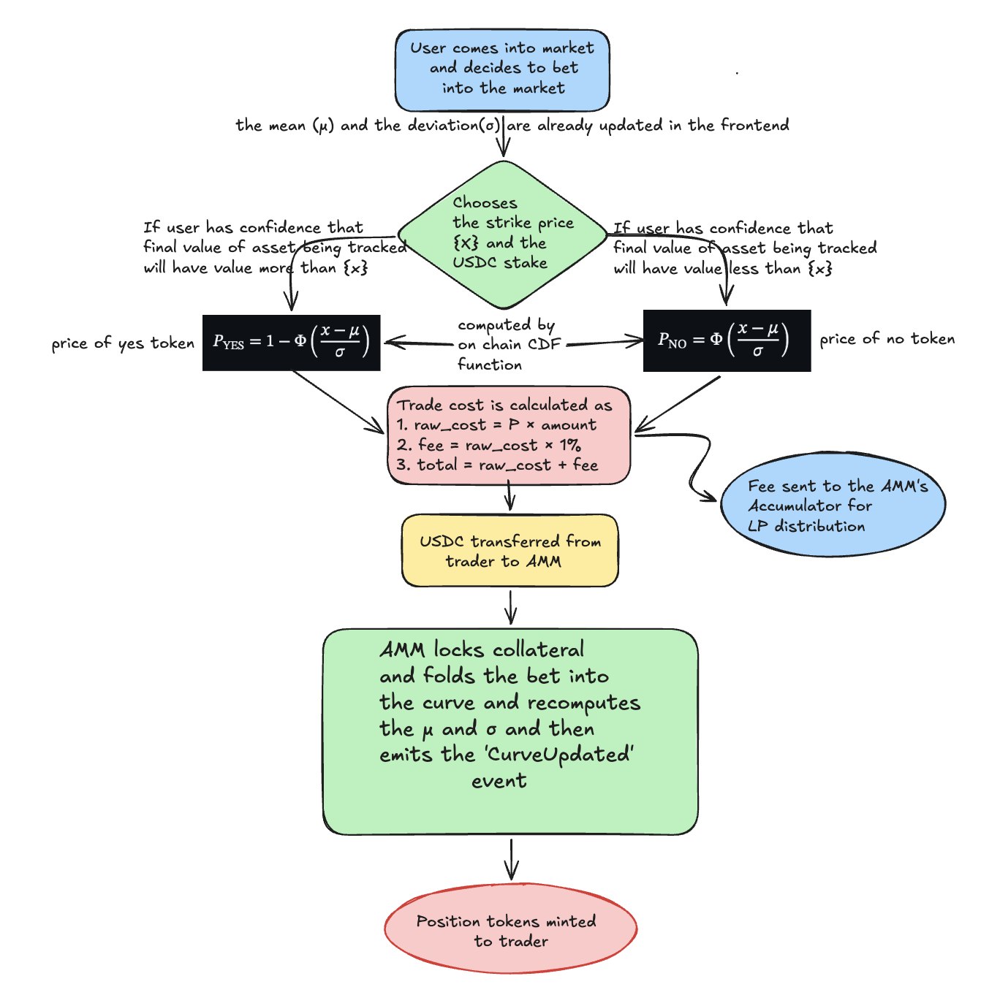

<div align="center">

# 🌊 Continuum

### A Unified Continuous Distribution Prediction Market Protocol

**Built on Sui · Powered by Move · Priced by Gaussian Mathematics**

[](https://move-language.github.io/move/)
[](https://sui.io/)
[](#11-project-license)
[](https://suiscan.xyz/testnet/home)

[](#)
[](#)
[](#)
[](#)

</div>

**Continuum** is a novel prediction market protocol built on **Sui** in the **Move** language. Instead of fragmenting liquidity across many separate binary "yes/no" pools, Continuum collapses all possible outcomes into a **single continuous liquidity curve** governed by a normal Gaussian probability density function. Our mission is to deliver a capital-efficient, mathematically precise, and demand-responsive platform for the future of prediction markets. This enables users to stake value across the many different possible outcomes under a single pool, preventing liquidity from being fragmented.

The core of **Continuum** translates the continuous Gaussian distribution into a fully on-chain pricing engine using fixed-point WAD arithmetic, an Abramowitz & Stegun error function approximation, and a Taylor-series exponential. It provides a superior alternative to fragmented binary pool designs, which require creating a separate liquidity pool for every strike price. Instead, users of our markets can bet under the same pool at the strike price of their choice. The complex mathematical model governing the protocol runs entirely on-chain at low cost on Sui, where Move's object model lets each market live as a single shared object with native, type-safe collateral and position handling.

## Addresses (Sui Testnet)

`Package:` [0x024febde4e1e8e5d7a259ec836de90ebd596289e89a38c199cb7414f56f00200](https://suiscan.xyz/testnet/object/0x024febde4e1e8e5d7a259ec836de90ebd596289e89a38c199cb7414f56f00200)

`Registry (shared):` [0x3c585041337389132541ecee0c2d1425ad539e147d18ba1d34f768dd4f1c8cab](https://suiscan.xyz/testnet/object/0x3c585041337389132541ecee0c2d1425ad539e147d18ba1d34f768dd4f1c8cab)

`Market #0 {BTC price @ 2026} (shared):` [0x7c17c24831ea92ec91389e61f5399c3005d9a1c511ceb76329e0a6b3825d7a09](https://suiscan.xyz/testnet/object/0x7c17c24831ea92ec91389e61f5399c3005d9a1c511ceb76329e0a6b3825d7a09)

`Collateral type:` `0x024febde4e1e8e5d7a259ec836de90ebd596289e89a38c199cb7414f56f00200::mock_usdc::MOCK_USDC`

## Table of Contents

* [1. Overview](#1-overview)
  * [1.1 Introduction](#11-introduction)
  * [1.2 The Continuum Solution: Continuous Gaussian Pricing](#12-the-continuum-solution-continuous-gaussian-pricing)
  * [1.3 Demand-Responsive Curve Dynamics](#13-demand-responsive-curve-dynamics)
  * [1.4 Settlement Against Reality](#14-settlement-against-reality)
  * [1.5 AMM Model Comparison](#15-amm-model-comparison)
  * [1.6 Conclusion](#16-conclusion)
* [2. Architecture](#2-architecture)
  * [2.1 High-Level Workflow](#21-high-level-workflow)
  * [2.2 Object Model: One Module, Shared Market Objects](#22-object-model-one-module-shared-market-objects)
  * [2.3 Trade Execution Infrastructure](#23-trade-execution-infrastructure)
  * [2.4 Liquidity Provision Infrastructure](#24-liquidity-provision-infrastructure)
  * [2.5 Fee Distribution Infrastructure](#25-fee-distribution-infrastructure)
  * [2.6 Market Resolution Infrastructure](#26-market-resolution-infrastructure)
  * [2.7 Settlement Infrastructure](#27-settlement-infrastructure)
* [3. Features](#3-features)
* [4. Technical Overview](#4-technical-overview)
* **[Design & deep dive → DESIGN.md](./docs/DESIGN.md)**
  * [5. Product roadmap: from hackathon PoC to consumer trading platform](./docs/DESIGN.md#5-product-roadmap-from-hackathon-poc-to-consumer-trading-platform)
  * [6. Module-by-module: math meets Move](./docs/DESIGN.md#6-module-by-module-math-meets-move)
  * [7. Sui & Move ecosystem best practices](./docs/DESIGN.md#7-sui--move-ecosystem-best-practices)
  * [8. Future plans: an AI oracle for resolution](./docs/DESIGN.md#8-future-plans-an-ai-oracle-for-resolution)
* [9. Getting Started](#9-getting-started)
  * [9.1 Prerequisites](#91-prerequisites)
  * [9.2 Installation](#92-installation)
  * [9.3 Building Contracts](#93-building-contracts)
  * [9.4 Running the Backend](#94-running-the-backend)
  * [9.5 Running the Frontend](#95-running-the-frontend)
* [10. Deployment](#10-deployment)
* [11. Project License](#11-project-license)
* [12. References](#12-references)

---

## 1. Overview

**Continuum** is a prediction market protocol that replaces the traditional approach of creating many separate binary outcome pools for tracking the same numerical asset with a single, unified continuous liquidity curve derived from the Gaussian (normal) distribution, serving as the base of distribution markets where people can stake on infinite outcomes. Built on **Sui** in the **Move** language, it performs all pricing mathematics entirely on-chain using **fixed-point arithmetic**.

The platform provides a complete prediction market experience: market creation, continuous-strike trading, liquidity provision and real-time analytics — all powered by a full-stack monorepo spanning a Move smart-contract package, a backend API with real-time WebSocket feeds, and a React frontend.

### What led to this project?

Prediction markets have entered popular consciousness in the wake of the 2024 US Presidential elections, but the technology is likely still in its infancy. Further development could be of benefit both to developers and to the public at large. More specifically, today's prediction markets generally allow participants to express probability distributions over discrete outcomes, but many questions of relevance to the real world involve continuous outcomes. It's true that a perp market could elicit the expected value of a continuous variable from the market, but sometimes we would like to know more -- for example, do we know for sure a given project will take 10 years exactly, or could it perhaps be anywhere between 2 and 20? Do we know that a given project will have 10,000 users exactly, or could it be anywhere between 2,000 and 20,000? These questions are important, and today's prediction markets don't allow us to answer them.


### 1.1 Introduction

#### The problem we solve:

Existing prediction market platforms like Polymarket create separate binary pools for each possible outcome: "Will ETH be worth $5k by the end of 2026? Yes/No", "Will ETH be worth $5.1k by the end of 2026? Yes/No", and so on. Each strike price needs its own pool, its own liquidity, and its own market makers. This design leads to:

- **Fragmented liquidity**: Capital is spread thinly across many isolated pools
- **Incomplete coverage**: Only a handful of discrete strike prices are offered
- **Inefficient capital deployment**: LPs must choose which specific pool to fund

#### The Nature of Continuous Outcomes

Many real-world prediction questions don't have binary answers — they have a continuous range of possible outcomes. "What will ETH be worth at the end of 2026?" could be $500, $3,000, $10,000, or any value in between. "In what year will OpenAI release its new model?" could be 2026, 2027, 2028, or any integer value in between. Forcing this continuous outcome space into discrete yes/no buckets is an artificial constraint that wastes capital and limits expressiveness.

#### Many markets tracking a single asset

Traditional prediction markets suffer from a fundamental structural inefficiency. Consider a market on ETH's future price:

| Approach | Pools Required | Liquidity per Pool | Coverage |
|----------|---------------|-------------------|----------|
| Current markets | N separate pools (one per strike) | Total capital / N | Discrete strikes only |
| **Continuum** | **1 unified pool** | **Total capital** | **Any strike price** |

With N separate pools, each pool receives only a fraction of the total liquidity. Traders at less popular strike prices face thin order books, wide spreads, and high slippage. Market makers must actively manage positions across many pools simultaneously.

### 1.2 The Continuum Solution: Continuous Gaussian Pricing

Continuum replaces discrete pools with a **single continuous Gaussian curve**. The probability of any outcome is derived from the cumulative distribution function (CDF) of a normal distribution:

$$P_{\text{YES}}(x) = 1 - \Phi\left(\frac{x - \mu}{\sigma}\right)$$

$$P_{\text{NO}}(x) = \Phi\left(\frac{x - \mu}{\sigma}\right)$$

Where:
- $x$ is the trader's chosen strike price (any continuous value)
- $\mu$ (mu) is the market's expected value — the consensus belief of all participants
- $\sigma$ (sigma) is the market's uncertainty — how spread out beliefs are
- $\Phi$ is the cumulative distribution function of the standard normal distribution

**Economic intuition:** A YES position at strike $x$ is a bet that the final outcome will be *at or above* $x$. The further $x$ is above the current consensus $\mu$, the less likely this is, and the cheaper the YES token becomes (lower $P_{\text{YES}}$). Conversely, NO tokens become cheaper as $x$ falls further below $\mu$.

#### On-Chain Gaussian Mathematics

The Gaussian CDF is computed entirely on-chain using fixed-point WAD arithmetic (18-decimal precision). The mathematical stack consists of:

- **WAD arithmetic**: `mul(a, b) = a * b / 1e18`, `div(a, b) = a * 1e18 / b`, over a signed fixed-point type
- **Error function**: Abramowitz & Stegun 5-coefficient polynomial approximation (max error ~1.5 x 10^-7):

$$\text{erf}(x) \approx 1 - (a_1 t + a_2 t^2 + a_3 t^3 + a_4 t^4 + a_5 t^5) e^{-x^2}, \quad t = \frac{1}{1 + px}$$

- **Exponential**: Taylor series expansion, clamped to a safe input range:

$$e^x = \sum_{n=0}^{N} \frac{x^n}{n!}$$

- **Square root**: integer Newton's method, used to derive σ from variance
- **Gaussian CDF**: Composed from the above primitives as:

$$\Phi(z) = \frac{1}{2}\left(1 + \text{erf}\left(\frac{z}{\sqrt{2}}\right)\right)$$

All functions use a signed 18-decimal fixed-point representation (`Fp` over `u256`), providing ~11 significant digits of precision. Move has no native signed integer, so `continuum::fixed_point` supplies a signed-magnitude `Fp { mag, neg }` — the Gaussian math needs signed values because `x − μ` is often negative and `erf` is odd.

### 1.3 Demand-Responsive Curve Dynamics

A critical innovation of Continuum is that **bettors move the curve, liquidity providers do not**.

The parameters $\mu$ and $\sigma$ are not static — they are a **stake-weighted distribution of all strike prices** bet by traders:

$$\mu = \frac{\sum w_i \cdot x_i}{\sum w_i} \qquad \sigma = \sqrt{\frac{\sum w_i \cdot x_i^2}{\sum w_i} - \mu^2}$$

Where each bet contributes weight $w_i$ (= its net stake in USDC) at strike $x_i$.

This is maintained on-chain via three running accumulators updated on every trade:

| Accumulator | Formula | Purpose |
|:------------|:--------|:--------|
| `acc_stake_weight` | $\sum w_i$ | Total conviction weight |
| `acc_weighted_x` | $\sum w_i \cdot x_i$ | Weighted strike sum (for $\mu$) |
| `acc_weighted_x_sq` | $\sum w_i \cdot x_i^2$ | Weighted strike-squared sum (for $\sigma$) |

**Why LPs cannot move the curve:** Liquidity providers are pure collateral underwriters. If LP deposits could shift $\mu$ and $\sigma$, they would be a free manipulation lever — someone could move the curve without taking any directional risk. By restricting curve movement to bettors who put capital at risk on a position, the protocol is manipulation-resistant by construction. On Sui this is enforced structurally: `add_liquidity` never touches the curve accumulators.

**The prior weight mechanism:** The market owner seeds an initial $\mu$ and $\sigma$ (a prior belief). This seed is backed by a configurable `prior_weight` of virtual stake, so the first real bet cannot swing the curve to a single point. As more bets accumulate, the prior's influence naturally dilutes. Once trading begins (`trades_started`), `set_distribution` / `set_prior_weight` are locked.

**Pre-update pricing:** Each bet is priced against the curve state *before* that bet shifts it, ensuring traders see fair prices that aren't self-referentially affected by their own trade.

### 1.4 Settlement Against Reality

$\mu$ is the market's *belief*, not the boundary it settles on. A market resolves against an externally-observed final price (set manually via `market::set_final_price` for this hackathon PoC — no oracle). Resolution can only begin once the market's scheduled close time (`resolves_at`, a `Clock` timestamp fixed at creation) has passed.

Each position is judged against **its own strike**:
- A YES position at strike $X$ pays $1/token if and only if `final_price >= X`
- A NO position at strike $X$ pays $1/token if and only if `final_price < X`

This means a bet that moves $\mu$ around cannot change who wins — settlement is always against the real-world outcome, not the market's consensus.

### 1.5 AMM Model Comparison

The table below compares Continuum with the best binary AMMs currently in production, Polymarket and CPMM markets.


### 1.6 Conclusion

Continuum represents a paradigm shift in prediction market design: from discrete binary pools to a continuous, unified liquidity curve. By deriving prices from the Gaussian CDF and making the curve demand-responsive (bettors move it, LPs don't), the protocol achieves unified liquidity, continuous pricing, capital efficiency, and manipulation resistance in a single design. The Gaussian mathematics are computed entirely on-chain in Move, and Sui's object model lets each market exist as a self-contained shared object with native, type-safe collateral and position handling.

---

## 2. Architecture

On Sui, the protocol is a **single Move package** (`continuum`). Sui has no EVM-style proxies, no `msg.sender` storage mappings, and no cross-contract delegatecalls — so what would be four cooperating contracts elsewhere collapses into one module that plays the AMM, router, LP-accounting, and factory roles at once. Each market is a plain shared object. The backend provides real-time indexing and a REST + WebSocket API by reading `Market<T>` object state and the package's Move events, while the frontend delivers a quantitative-finance-inspired terminal UI.

### 2.1 High-Level Workflow


**User Journey:**



### 2.2 Object Model: One Module, Shared Market Objects

Continuum is one module, `continuum::market`, built around a small set of Sui objects:

```
continuum::market
  ├── Registry (shared, created once in init)
  │     └── factory + discovery: counts markets, maps market_id → Market object id
  ├── Market<phantom T> (shared, one per market)
  │     ├── Balance<T> vault          ── all collateral custody
  │     ├── Gaussian curve params     ── mu, sigma, sigma_min, prior_weight
  │     ├── demand accumulators       ── acc_stake_weight, acc_weighted_x, acc_weighted_x_sq
  │     ├── LP bookkeeping            ── total_shares + Table<address, LpAccount>
  │     ├── per-token liabilities     ── Table<u256, Fp>
  │     └── settlement state          ── final_price, market_resolved, resolves_at
  ├── Position (owned: has key, store) ── a YES/NO bet; minted per buy, consumed on claim
  └── LpAccount (has store, in Market's Table) ── { shares, reward_debt }, keyed by address
```

| Role | How Continuum does it on Sui |
|:-----|:-----------------------------|
| AMM + Router + LP token + Factory | one `continuum::market` module |
| Per-market deployment | each market is a shared `Market<T>` object (no clones, no CREATE2) |
| Positions | owned `Position` objects, transferred natively |
| LP token (non-transferable) | per-address `LpAccount` rows in a `Table` — nothing to transfer |
| Collateral custody | a `Balance<T>` vault; collateral is any `Coin<T>` |
| Discovery | a shared `Registry` (`market_count` / `get_market` / `market_exists`) |

`T` is the collateral coin type — `continuum::mock_usdc::MOCK_USDC` for local/testnet, the real USDC coin type on mainnet.

**Module breakdown:**

| Source | Responsibility | Key Functions |
|:-------|:--------------|:-------------|
| `market.move` | Registry, market lifecycle, AMM/router/LP roles, settlement | `create_market`, `add_liquidity`, `remove_liquidity`, `buy_yes`, `buy_no`, `set_final_price`, `claim_winnings`, `release_losing_collateral` |
| `gaussian.move` | On-chain Gaussian math: PDF, CDF, erf, exp, sqrt | `normal_cdf`, `normal_pdf`, `erf`, `exp_wad`, `sqrt_wad` |
| `fixed_point.move` | Signed WAD fixed-point `Fp` over `u256` | `mul`, `div`, `add`, `sub`, `neg`, `abs`, comparisons |
| `mock_usdc.move` | 6-decimal mock USDC collateral coin + faucet | `mint`, `faucet` |

### 2.3 Trade Execution Infrastructure

Trading in Continuum allows users to express beliefs about continuous outcomes by purchasing YES or NO tokens at any strike price.

**Core Functions:** `buy_yes(market, payment, target_mag, target_neg)` and `buy_no(market, payment, target_mag, target_neg)`.

Each buy takes the full stake as a `Coin<T>` payment, sends a 1% fee to LPs, underwrites the position with the rest, folds the bet into the curve accumulators, and mints a fresh `Position` object to the buyer. Prices are computed against the **pre-update** curve.

**Execution Flow:**



**Position identity:** each `(strike, direction)` pair maps to a deterministic token id via `derive_token_id` (keccak256 of `market_id ‖ strike_mag ‖ sign ‖ is_yes`), used to track per-token liabilities; the buyer's stake itself is a distinct owned `Position` object.

### 2.4 Liquidity Provision Infrastructure

Liquidity providers in Continuum are pure collateral underwriters — they fund the pool that pays out winning bets, and earn trading fees in return.

**Core Functions:** `add_liquidity(market, payment)` and `remove_liquidity(market, shares_to_remove)`.

**Key Design: Curve-Neutral Deposits**

Unlike traditional AMMs where LP deposits affect the trading curve, Continuum LP deposits are **strictly curve-neutral** — `add_liquidity` never touches `mu`/`sigma` or the demand accumulators. LPs always provide at the current $\mu/\sigma$ and never shift the curve. Deposits and withdrawals settle any pending fees first, and removal is solvency-checked against free liquidity.


### 2.5 Fee Distribution Infrastructure

Continuum uses a **MasterChef-style fee accumulator** to distribute trading fees to LPs proportionally without requiring gas-intensive iteration.

**Mechanism:**

- Each trade's 1% fee updates a global accumulator: `acc_fee_per_share`
- Each LP's pending fees = `shares * acc_fee_per_share / WAD - reward_debt`
- On deposit, `reward_debt` is set so new LPs don't claim old fees
- On withdrawal or `claim_fees`, pending fees are calculated and transferred

This pattern provides O(1) fee distribution regardless of the number of LPs.

### 2.6 Market Resolution Infrastructure

Resolution uses a **two-phase timelock** to provide a dispute window. Both resolution paths additionally require the scheduled close `resolves_at` to have passed, enforced via the shared `&Clock`.

**Flow:**

1. **Propose:** Owner calls `propose_resolution(price, &Clock)` — starts a 24-hour timer
2. **Wait:** Anyone can inspect the proposal during the 24h window; owner can `cancel_resolution`
3. **Execute:** After the timer expires, `execute_resolution(market, &Clock)` finalizes the market
4. The market's `market_resolved` flag is set, disabling further trading and liquidity operations

A single-shot `set_final_price(market, price_mag, price_neg, &Clock)` is also available to the owner for immediate resolution once `resolves_at` has passed.

### 2.7 Settlement Infrastructure

After resolution, participants settle positions through a **pull-based claiming** model.

**For Winners:**

- `claim_winnings(market, position)` consumes a winning `Position` object
- A YES position at strike $X$ wins if `final_price >= X`; a NO position wins if `final_price < X`
- The position is consumed and USDC is paid out from the market's collateral vault (1 USDC/token)

**For Losing Positions:**

- `release_losing_collateral(market, target_mag, target_neg, is_yes)` — permissionless
- Frees LP collateral that was locked against a position that lost
- Returns the collateral to the available liquidity pool for LP withdrawal

---

## 3. Features

- **Unified Continuous Liquidity:** One pool serves all strike prices — no liquidity fragmentation. Any continuous strike price gets an instant, mathematically derived price from the Gaussian CDF.

- **Demand-Responsive Curve:** $\mu$ and $\sigma$ are stake-weighted aggregates of all bets. The curve tracks collective market belief and requires capital at risk to move — manipulation-resistant by construction.

- **Curve-Neutral LP Deposits:** Liquidity providers are pure collateral underwriters. Their deposits never shift the curve, preventing free manipulation via liquidity.

- **On-Chain Gaussian Mathematics:** Full CDF/PDF computation on-chain using an Abramowitz & Stegun erf approximation, a Taylor-series exponential, and integer Newton's-method square root — all in 18-decimal signed fixed-point WAD arithmetic (~11 significant digits).

- **Shared-Object Markets:** Each market is a plain Sui shared `Market<T>` object — no proxies, no CREATE2, no delegatecall. Markets are created permissionlessly and discovered via a shared `Registry`.

- **MasterChef Fee Distribution:** Trading fees (1% per trade) distributed to LPs proportionally via a global accumulator — O(1) gas regardless of LP count.

- **Non-Transferable LP Positions:** LP shares live as `LpAccount` rows in a per-market `Table` keyed by address — there is no token to transfer, simplifying fee accounting by construction.

- **Two-Phase Resolution with Timelock:** 24-hour dispute window between proposal and execution, gated by a scheduled `resolves_at` close time and enforced with Sui's shared `Clock`.

- **Generic Collateral:** `Market<phantom T>` works with any `Coin<T>` — mock USDC locally, real USDC on mainnet, with no token-address wiring.

- **Real-Time Backend:** Express 5 + Socket.io server polls the package's Move events and reads `Market<T>` object state via `@mysten/sui`, maintains a database via Prisma, and broadcasts live curve updates to connected frontends.

- **Quantitative Terminal UI:** React + Vite frontend with d3-powered Gaussian curve visualization and a "signal/noise" design aesthetic inspired by quantitative finance terminals.

---

## 4. Technical Overview

| Layer | Technology |
|-------|------------|
| Smart Contracts | **Sui Move** (`edition = 2024.beta`), Sui framework — one `continuum` package |
| Monorepo | pnpm workspaces (JS packages) + a standalone Move package |
| Backend API | Node.js, TypeScript, Express 5, Socket.io, `@mysten/sui` |
| Database | Prisma ORM (SQLite for local dev, PostgreSQL in production) |
| Indexer | Sui event poller (RPC polling of the package's Move events) |
| Frontend | React + TypeScript + Vite + Tailwind + d3 |
| Shared Types | TypeScript package with Move package/function references |
| Deployment | Sui testnet (`sui client publish`) |

## Deep dive: design, internals & roadmap

The in-depth material — the product roadmap, the module-by-module walkthrough of how
the Gaussian math maps to Move, Sui/Move engineering practices, and the planned
multi-agent AI oracle for resolution — lives in **[docs/DESIGN.md](./docs/DESIGN.md)**:

* [5. Product roadmap: from hackathon PoC to consumer trading platform](./docs/DESIGN.md#5-product-roadmap-from-hackathon-poc-to-consumer-trading-platform)
* [6. Module-by-module: math meets Move](./docs/DESIGN.md#6-module-by-module-math-meets-move)
* [7. Sui & Move ecosystem best practices](./docs/DESIGN.md#7-sui--move-ecosystem-best-practices)
* [8. Future plans: an AI oracle for resolution](./docs/DESIGN.md#8-future-plans-an-ai-oracle-for-resolution)


---

## 9. Getting Started

Follow these instructions to set up the project locally for development and testing.

### 9.1 Prerequisites

- **Sui CLI** ([install guide](https://docs.sui.io/guides/developer/getting-started/sui-install)) with a testnet environment configured
- **Node.js** (v18+) and **pnpm** for the monorepo
- **SQLite** (bundled; no setup) for local backend dev, or **PostgreSQL** for production

### 9.2 Installation

Clone the repository and install all workspace dependencies:

```bash
git clone <repository_url>
cd Continuum
pnpm install
```

### 9.3 Building Contracts

The contracts are a single Sui Move package, compiled and tested with the Sui CLI:

```bash
cd packages/contracts
sui move build          # compile all source modules
sui move test           # run unit (math) + full market-lifecycle tests

# or from the repo root:
pnpm build:contracts
pnpm test:contracts
```

### 9.4 Running the Backend

```bash
cd packages/backend
cp .env.example .env     # fill in PACKAGE_ID, REGISTRY_ID, COLLATERAL_TYPE
pnpm install
pnpm start               # db:push → db:seed (discovers markets from chain) → start:api on :3001
```

The seed discovers every market from `MarketCreated` events; the event poller then keeps μ/σ, liquidity, positions, and resolution state in sync. Required env: `SUI_RPC_URL`, `PACKAGE_ID`, `REGISTRY_ID`, `COLLATERAL_TYPE`.

### 9.5 Running the Frontend

```bash
# Start the Vite dev server
pnpm --filter @continuum/frontend dev
```

> **Note:** the frontend's wallet/transaction layer is still being migrated to Sui (`@mysten/dapp-kit` + `@mysten/sui`). It consumes the backend's REST + Socket.io API for market state.

---

## 10. Deployment

### Contract Deployment (Sui Testnet)

```bash
# 1. Ensure you have a funded testnet address
sui client active-address
sui client faucet          # or https://faucet.sui.io
sui client gas

# 2. Build and publish the package
cd packages/contracts
sui move build
sui client publish --gas-budget 200000000
```

`init` runs at publish: it creates and shares the `Registry`, and (since `mock_usdc` is included) mints the `TreasuryCap<MOCK_USDC>` to the publisher. From the publish output, record the **package ID**, the shared **`Registry` object ID**, and the **`TreasuryCap<MOCK_USDC>` id**.

```bash
# 3. Create a market so the backend has something to index
sui client call --package $PACKAGE_ID --module market --function create_market \
  --type-args $PACKAGE_ID::mock_usdc::MOCK_USDC \
  --args $REGISTRY_ID "What will BTC be at end of 2026?" 100000000000000000 <resolves_at_ms> \
  --gas-budget 100000000
# (sigma_min_mag is WAD; resolves_at is a Clock ms timestamp, must be > 0.)
```

### Deployed Objects (Sui Testnet)

| Object | Id |
|--------|----|
| Package | `0x024febde4e1e8e5d7a259ec836de90ebd596289e89a38c199cb7414f56f00200` |
| Registry (shared) | `0x3c585041337389132541ecee0c2d1425ad539e147d18ba1d34f768dd4f1c8cab` |
| Market #0 (shared) | `0x7c17c24831ea92ec91389e61f5399c3005d9a1c511ceb76329e0a6b3825d7a09` |
| TreasuryCap\<MOCK_USDC\> | `0xbffb37f5be5ff8081cd7d8024444618b8ae32014ad9f957761337d037b504620` |
| Collateral type | `0x76ab32...::mock_usdc::MOCK_USDC` |

---


## 11. Project License

This project is licensed under the **MIT License**.

---

## 12. References

- **Gaussian Distribution (Normal Distribution):** [Wikipedia — Normal Distribution](https://en.wikipedia.org/wiki/Normal_distribution)
- **Abramowitz & Stegun Error Function Approximation:** Handbook of Mathematical Functions, Formula 7.1.26
- **Sui Documentation:** [Sui Docs](https://docs.sui.io/)
- **The Move Programming Language:** [Move Book](https://move-book.com/)
- **Sui Object Model:** [Object Ownership](https://docs.sui.io/concepts/object-ownership)
- **MasterChef Fee Distribution Pattern:** [SushiSwap MasterChef](https://docs.sushi.com/)
- **Distribution Market Design:** [Paradigm Distribution Market Research](https://www.paradigm.xyz/2024/12/distribution-markets)
- **Prediction Market Design:** [Paradigm PM-AMM Research](https://www.paradigm.xyz/2024/11/pm-amm)
- **Multi-Agent AI Oracle (planned resolution layer):** Tarun Kota, *Design and Evaluation of Multi-Agent AI Oracle Systems for Prediction Market Resolution* — [arXiv:2605.30802](https://arxiv.org/pdf/2605.30802)
